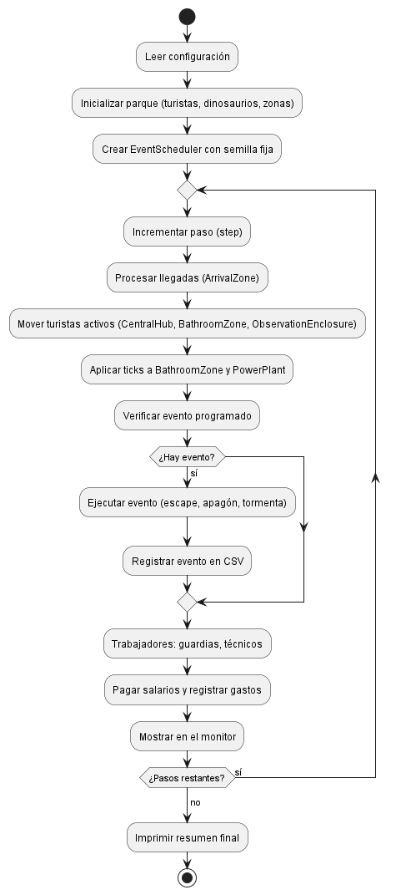
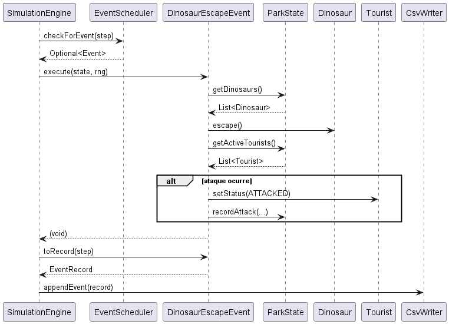

# 🦕 Simulador de parque de dinosaurios 🦕

Simulador de un parque temático de dinosaurios desarrollado en Java como proyecto académico. El programa modela la afluencia de turistas, el comportamiento de los dinosaurios, eventos aleatorios y la economía del parque, generando reportes en CSV.

## Herramientas utilizadas

- **Java 17** (LTS)
- **Maven 3.8+** 
- **JUnit 5.10.2** 
- **Mockito 5.23.0** 
- **JaCoCo 0.8.14** 
- **CSV** 

## Configuración

1. Clona el repositorio:
   ```
   git clone https://github.com/VeronicaRG-asamitaka/laboratorio-4-veronica-ruiz.git
   
2. Asegúrate de tener Java 17 y Maven instalados:
   ```
   java -version
   mvn -version
3. Configura los parámetros de simulación en src/main/resources/park.properties (opcional – los valores por defecto ya funcionan).

▶ Ejecución del proyecto

1. Compilar
    ```
    mvn compile

2. Ejecutar la simulación
    ```
    mvn exec:java

3. Ejecutar los tests y generar reporte de cobertura
    ```
    mvn clean test
    mvn jacoco:report

4. Abre target/site/jacoco/index.html en tu navegador para ver la cobertura.

## Explicación general del sistema
El simulador avanza en pasos discretos (steps). En cada paso:

1. Llegan turistas a la zona de llegada (ArrivalZone) en lotes y compran boletos.

2. Los turistas activos (estado IN_PARK) visitan:

    -CentralHub (pueden comprar souvenirs)

    -BathroomZone (pueden usar el baño o SPA)

    -ObservationEnclosure (encierro aleatorio, pagan entrada y dan puntuación de satisfacción)

3. Las zonas actualizan su estado:

    -BathroomZone.tick() libera puestos después de useDurationSteps.

    -PowerPlant.tick() consume energía, y con probabilidad failureProbability falla.

4. Ocurre un evento (si el EventScheduler lo determina):

    -DinosaurEscapeEvent: un dinosaurio escapa y puede atacar a un turista.

    -BlackoutEvent: la planta eléctrica falla y se añade un gasto extra.

    -StormEvent: todos los turistas registran evacuación y se añade un gasto.

5. Los trabajadores actúan:

    -Guard  devuelve dinosaurios escapados a sus encierros.

    -Technician repara la planta si no está operativa.

    -Se registra el gasto de salarios de todos los trabajadores.

6. El monitor muestra el estado actual por consola.

    -Al final de la simulación se generan tres archivos CSV en la carpeta output/:

        *revenues.csv (ingresos por boletos, souvenirs, SPA, entradas)

        *expenses.csv (gastos por salarios, eventos, reparaciones)

        *events.csv (registro de eventos ocurridos)

## Patrones  de diseño utilizados
-Singleton – ParkConfig
    Garantiza una única instancia de configuración leída desde park.properties. Su constructor es private y se accede mediante ParkConfig.getInstance().

-Strategy – SimulationEvent
    Define una familia de eventos intercambiables que implementan la misma interfaz. El EventScheduler puede ejecutar cualquier evento sin conocer su implementación concreta.

## Diagramas
-El código de los diagramas se encuentran en diagramas/codigos

-Los archivos .png de los diagramas se encuentran en diagramas/png:




    